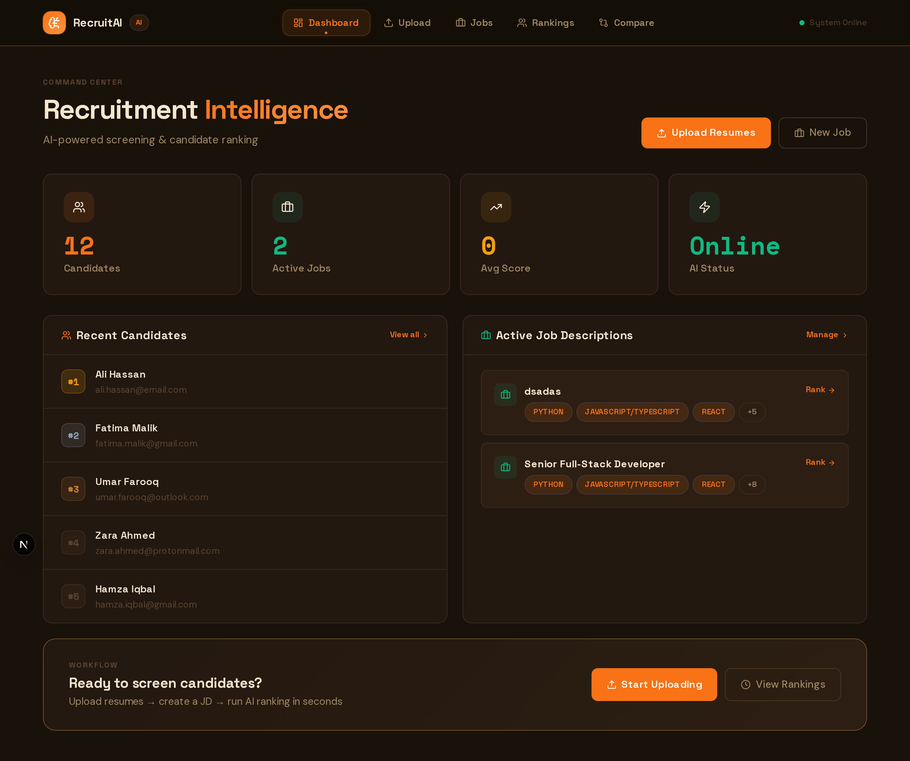
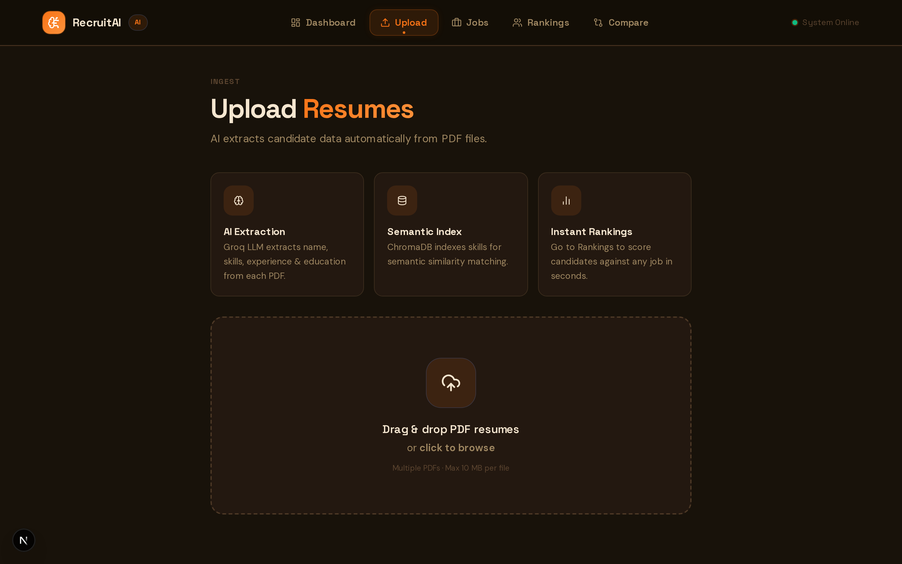
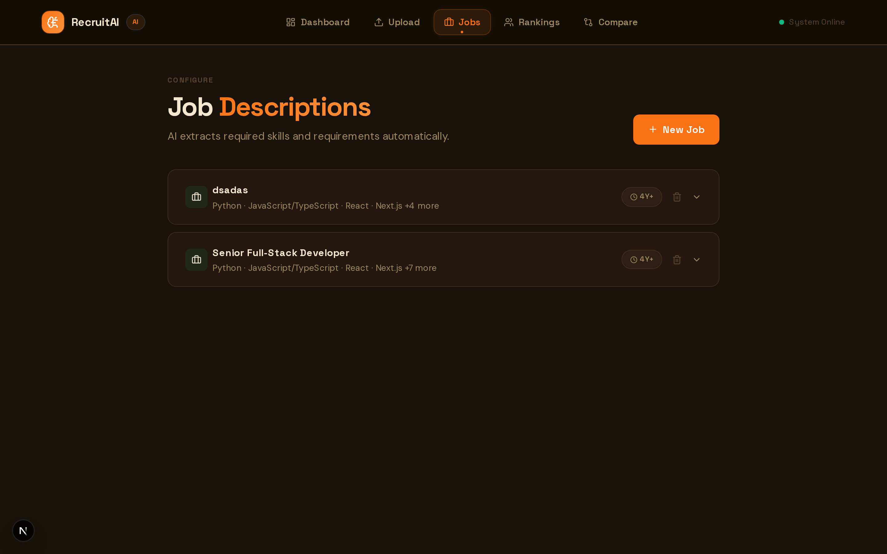
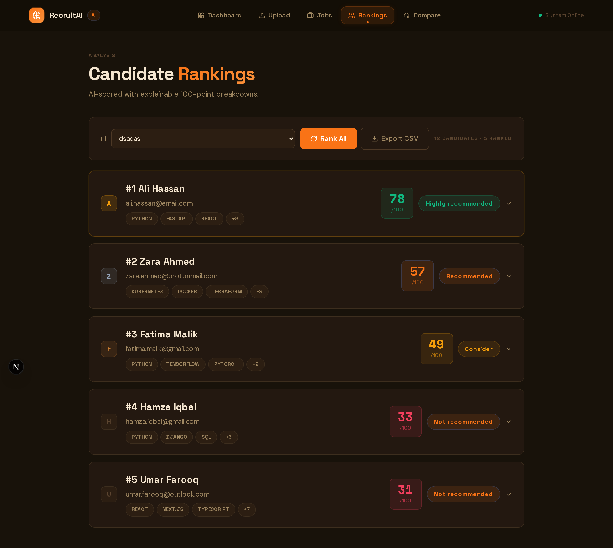
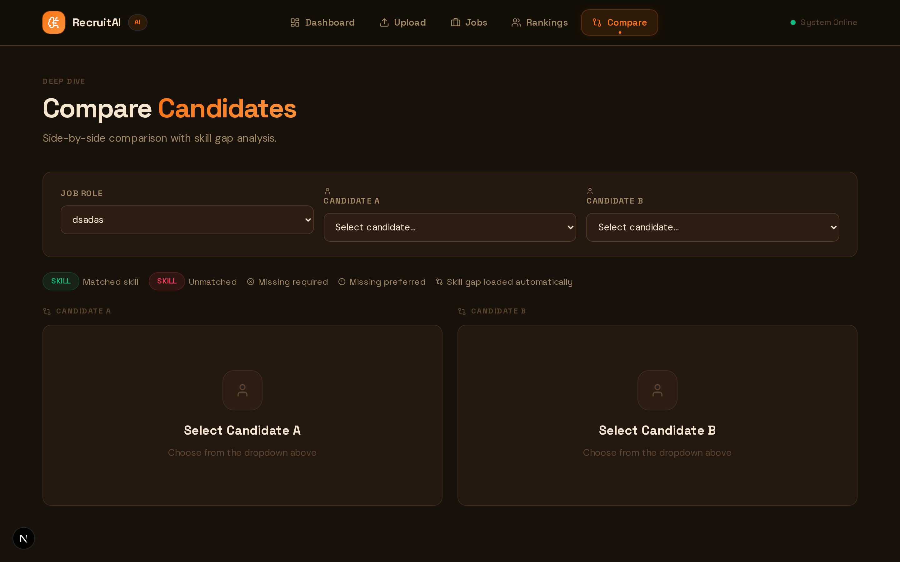
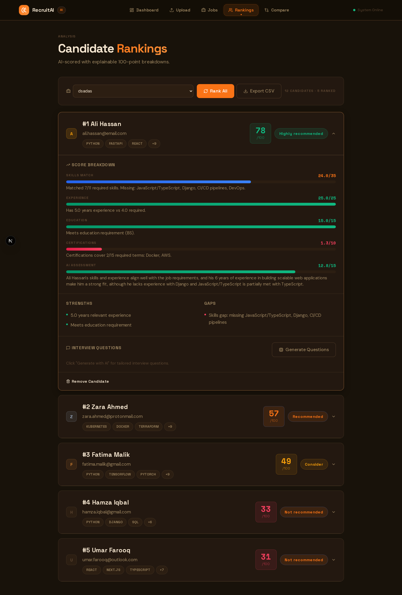

# RecruitAI — AI-Powered Resume Screening & Candidate Ranking

**TEYZIX Internship Project — Task 2**

An intelligent recruitment assistant that screens resumes, extracts structured candidate data, and ranks applicants against job descriptions using Groq LLM, ChromaDB semantic search, and a 100-point explainable scoring engine.

**Live Demo:** [https://recruit-ai-mu.vercel.app](https://recruit-ai-mu.vercel.app)  
**Backend API:** [https://recruitai-production.up.railway.app/docs](https://recruitai-production.up.railway.app/docs)

---

## Screenshots

| Dashboard | Upload Resumes |
|-----------|---------------|
|  |  |

| Job Descriptions | Rankings |
|-----------------|---------|
|  |  |

| Candidate Compare | Expanded Ranking Card |
|------------------|-----------------------|
|  |  |

---

## Features

| Feature | Description |
|---------|-------------|
| **PDF Resume Upload** | Drag-and-drop multi-file PDF uploader with progress indicators |
| **AI Extraction** | Groq `llama-3.3-70b-versatile` extracts name, email, skills, experience, education |
| **JD Analysis** | AI parses job descriptions into structured requirements (skills, experience, education) |
| **Candidate Ranking** | 100-point explainable scoring across 5 dimensions |
| **Semantic Skills** | ChromaDB vector search matches synonyms — "React" matches "ReactJS", "React.js" |
| **Score Breakdown** | Per-dimension scores with AI reasoning text shown in expandable UI |
| **Interview Questions** | AI generates 5 tailored interview questions per candidate on demand |
| **Skill Gap Analysis** | Missing required vs. preferred skills highlighted per candidate |
| **Candidate Compare** | Side-by-side comparison of any two ranked candidates |
| **CSV Export** | Download full rankings as spreadsheet |

---

## Tech Stack

| Layer | Technology | Purpose |
|-------|-----------|---------|
| **Backend** | FastAPI (Python 3.11+) | REST API server |
| **AI / LLM** | Groq API — `llama-3.3-70b-versatile` | Resume parsing, scoring, Q generation |
| **PDF Processing** | pdfplumber | Text extraction from uploaded PDFs |
| **Vector Search** | ChromaDB + sentence-transformers | Semantic skill matching |
| **Database** | SQLite via SQLModel | Candidate and job storage |
| **Frontend** | Next.js 15 + TypeScript | UI framework |
| **Styling** | Custom CSS design system (Warm Dark theme) | No Tailwind UI components |
| **Charts** | Recharts | Score visualization |
| **File Upload** | react-dropzone | PDF drag-and-drop |

---

## How It Works

### End-to-End Flow

```
PDF Upload → pdfplumber text extraction
         → Groq LLM: extract name, email, skills, experience, education, certs
         → ChromaDB: embed skills as vectors

Job Description → Groq LLM: extract required skills, experience, education level
               → ChromaDB: embed required skills as vectors

Rank Request → For each candidate:
              1. Skills Match (35 pts): ChromaDB cosine similarity + exact match
              2. Experience (25 pts): years vs. JD minimum
              3. Education (15 pts): degree level vs. JD requirement
              4. Certifications (10 pts): keyword match against JD
              5. AI Assessment (15 pts): Groq holistic fit score (0-10 → normalized)
             → Total score 0-100
             → Sort descending
             → Return per-dimension reasoning strings
```

### AI Models Used

All AI calls route through **Groq API** (free tier available):

| Task | Model | Typical Latency |
|------|-------|-----------------|
| Resume extraction | `llama-3.3-70b-versatile` | ~2s |
| JD parsing | `llama-3.3-70b-versatile` | ~1s |
| Holistic scoring | `llama-3.3-70b-versatile` | ~1s |
| Interview Q gen | `llama-3.3-70b-versatile` | ~3s |

---

## Scoring Methodology

Candidates are scored on **100 points** across five explainable dimensions:

```
Skills Match      35 pts  — ChromaDB cosine similarity + exact keyword overlap
Experience        25 pts  — Candidate years ÷ required years (capped at 1.0)
Education         15 pts  — Degree level mapping: none→PhD scored 0→15
Certifications    10 pts  — Matching cert keywords found in JD
AI Assessment     15 pts  — Groq rates holistic fit 0-10 → ×1.5
─────────────────────────
Total            100 pts
```

### Skills Match Detail (35 pts)

ChromaDB embeds both candidate skills and JD required skills as vectors using `all-MiniLM-L6-v2`. Cosine similarity above 0.75 counts as a match. This catches:
- Exact: "Python" → "Python"
- Synonyms: "React" → "ReactJS", "React.js"
- Related: "Machine Learning" → "Deep Learning"

### AI Assessment Detail (15 pts)

Groq receives the candidate's full profile and the JD, and rates overall fit as a number 0–10 with a brief reasoning paragraph. This dimension captures signals not caught by keyword/year math — career trajectory, domain relevance, project experience quality.

Full methodology: [docs/scoring_methodology.md](docs/scoring_methodology.md)

---

## Project Structure

```
task 2/
├── backend/
│   ├── app/
│   │   ├── main.py               # FastAPI app + CORS + router registration
│   │   ├── config.py             # Settings loaded from .env (Groq key, upload dir)
│   │   ├── models/
│   │   │   ├── candidate.py      # Pydantic + SQLModel schemas for candidates
│   │   │   └── job.py            # Pydantic + SQLModel schemas for jobs
│   │   ├── services/
│   │   │   ├── pdf_processor.py  # pdfplumber: extract raw text from PDF bytes
│   │   │   ├── ai_extractor.py   # Groq calls: parse resume text → structured data
│   │   │   ├── matching_engine.py# 100-pt scoring logic across all 5 dimensions
│   │   │   └── vector_store.py   # ChromaDB init, embed skills, cosine search
│   │   ├── api/
│   │   │   ├── resumes.py        # POST /api/resumes/ (upload), GET /api/resumes/
│   │   │   ├── jobs.py           # CRUD /api/jobs/
│   │   │   └── analysis.py       # POST /api/analysis/rank, /compare, /export, /chat
│   │   └── storage/
│   │       └── database.py       # SQLite engine + session factory
│   ├── run.py                    # uvicorn entry point
│   ├── generate_samples.py       # Script to create sample PDF resumes
│   ├── requirements.txt
│   ├── .env.example
│   ├── Procfile                  # Railway/Heroku deployment
│   └── railway.json              # Railway platform config
├── frontend/
│   ├── app/
│   │   ├── layout.tsx            # Root layout + Navbar
│   │   ├── page.tsx              # Dashboard: stats + recent activity
│   │   ├── upload/page.tsx       # Resume uploader with drag-and-drop
│   │   ├── jobs/page.tsx         # Job CRUD + AI-generate JD
│   │   ├── candidates/page.tsx   # Ranked list + score breakdown + interview Qs
│   │   └── compare/page.tsx      # Side-by-side candidate comparison
│   ├── components/
│   │   ├── Navbar.tsx
│   │   ├── ScoreDimensionBar.tsx # Animated score bar for each dimension
│   │   └── ui/                   # shadcn base components
│   ├── lib/
│   │   ├── api.ts                # Typed API client (all backend calls)
│   │   └── types.ts              # TypeScript types matching backend schemas
│   ├── app/globals.css           # Full custom CSS design system (Warm Dark theme)
│   ├── vercel.json               # Vercel deployment config
│   └── .env.example
├── samples/
│   ├── resumes/                  # 5 sample PDF resumes for testing
│   └── job_descriptions/         # 2 sample JD text files
├── docs/
│   ├── architecture.md           # System design, data flow, component diagram
│   ├── api_reference.md          # All REST endpoints with request/response examples
│   └── scoring_methodology.md    # Detailed scoring algorithm documentation
├── screenshots/                  # UI screenshots (captured at 2x HiDPI)
│   ├── 01_dashboard.png
│   ├── 02_upload.png
│   ├── 03_jobs.png
│   ├── 04_rankings.png
│   ├── 05_compare.png
│   └── 06_rankings_expanded.png
├── .gitignore
└── README.md
```

---

## Setup & Installation

### Prerequisites

- Python 3.11+
- Node.js 18+
- Groq API key — free at [console.groq.com](https://console.groq.com)

### 1. Clone the repo

```bash
git clone https://github.com/YOUR_USERNAME/recruitai.git
cd recruitai
```

### 2. Backend Setup

```bash
cd "task 2/backend"

# Create and activate virtual environment
python -m venv venv
source venv/bin/activate        # Windows: venv\Scripts\activate

# Install dependencies
pip install -r requirements.txt

# Configure environment variables
cp .env.example .env
nano .env                       # Add your GROQ_API_KEY here

# (Optional) Generate sample PDF resumes
python generate_samples.py

# Start the API server
python run.py
```

Backend runs at `http://localhost:8000`  
Swagger UI at `http://localhost:8000/docs`

### 3. Frontend Setup

```bash
cd "task 2/frontend"

# Install dependencies
npm install

# Configure environment
cp .env.example .env.local
# Default NEXT_PUBLIC_API_URL=http://localhost:8000 works for local dev

# Start dev server
npm run dev
```

Frontend runs at `http://localhost:3000`

---

## Quick Start — Testing the System

1. **Open** `http://localhost:3000`
2. **Upload** → drag and drop PDF resumes from `samples/resumes/`
3. **Jobs** → click **New Job** → paste content from `samples/job_descriptions/senior_full_stack_developer.txt`
4. **Rankings** → select the job from dropdown → click **Rank Candidates**
5. **Expand** any candidate card to see the 5-dimension score breakdown and reasoning
6. **Generate Questions** button → AI produces 5 tailored interview questions
7. **Compare** → select any two candidates for side-by-side view
8. **Export CSV** → download full ranked list as spreadsheet

---

## Sample Data

Five realistic PDF resumes in `samples/resumes/`:

| File | Profile |
|------|---------|
| `ali_hassan_resume.pdf` | Senior Full-Stack Developer, 6 yrs, AWS certified |
| `fatima_malik_resume.pdf` | ML Engineer, 4 yrs, Google ML certified |
| `umar_farooq_resume.pdf` | Frontend Developer, 2 yrs, React/Next.js |
| `zara_ahmed_resume.pdf` | DevOps Engineer, 5 yrs, CKA certified |
| `hamza_iqbal_resume.pdf` | Junior Backend Developer, fresh grad |

Two job descriptions in `samples/job_descriptions/`:
- `senior_full_stack_developer.txt` — requires React, Node.js, 4+ yrs, AWS preferred
- `machine_learning_engineer.txt` — requires Python, PyTorch/TensorFlow, 3+ yrs, ML certs preferred

---

## API Reference

### Core Endpoints

| Method | Endpoint | Description |
|--------|----------|-------------|
| `GET` | `/api/health` | Health check |
| `POST` | `/api/resumes/` | Upload PDF resume(s) |
| `GET` | `/api/resumes/` | List all candidates |
| `GET` | `/api/resumes/{id}` | Get single candidate |
| `DELETE` | `/api/resumes/{id}` | Delete candidate |
| `POST` | `/api/jobs/` | Create job description |
| `GET` | `/api/jobs/` | List all jobs |
| `PUT` | `/api/jobs/{id}` | Update job |
| `DELETE` | `/api/jobs/{id}` | Delete job |
| `POST` | `/api/analysis/rank` | Rank candidates for a job |
| `POST` | `/api/analysis/compare` | Compare two candidates |
| `GET` | `/api/analysis/export/{job_id}` | Export rankings as CSV |

### Upload Resume

```bash
curl -X POST http://localhost:8000/api/resumes/ \
  -F "files=@ali_hassan_resume.pdf"
```

Response:
```json
[{
  "id": "uuid",
  "name": "Ali Hassan",
  "email": "ali@example.com",
  "skills": ["Python", "React", "AWS", "Docker"],
  "experience_years": 6,
  "education": "Bachelor's in Computer Science",
  "certifications": ["AWS Solutions Architect"]
}]
```

### Rank Candidates

```bash
curl -X POST http://localhost:8000/api/analysis/rank \
  -H "Content-Type: application/json" \
  -d '{"job_id": "job-uuid", "candidate_ids": ["uuid1", "uuid2"]}'
```

Response:
```json
[{
  "candidate_id": "uuid1",
  "name": "Ali Hassan",
  "total_score": 87.5,
  "recommendation": "Strong Hire",
  "dimension_scores": {
    "skills_match": {"score": 30, "max": 35, "reasoning": "8/10 required skills matched..."},
    "experience": {"score": 22, "max": 25, "reasoning": "6 years vs 4 required..."},
    "education": {"score": 12, "max": 15, "reasoning": "Bachelor's meets requirement..."},
    "certifications": {"score": 8, "max": 10, "reasoning": "AWS cert matches JD requirement..."},
    "ai_assessment": {"score": 13, "max": 15, "reasoning": "Strong full-stack background..."}
  }
}]
```

Full API reference: [docs/api_reference.md](docs/api_reference.md)

---

## Deployment

### Frontend → Vercel

1. Import repo into [vercel.com](https://vercel.com)
2. Set root directory to `task 2/frontend`
3. Add env var: `NEXT_PUBLIC_API_URL=https://recruitai-production.up.railway.app`
4. Deploy — `vercel.json` handles the rest

**Deployed at:** [https://recruit-ai-mu.vercel.app](https://recruit-ai-mu.vercel.app)

### Backend → Railway

1. Create new project on [railway.app](https://railway.app)
2. Connect this GitHub repo
3. Set root directory to `task 2/backend`
4. Add env var: `GROQ_API_KEY=your_key_here`
5. Railway auto-detects `railway.json` and `Procfile`

> **Note:** ChromaDB and SQLite data is ephemeral on Railway's free tier. For production, use a persistent volume or switch to PostgreSQL + Pinecone.

---

## Environment Variables

### Backend (`.env`)

| Variable | Default | Description |
|----------|---------|-------------|
| `GROQ_API_KEY` | — | **Required.** Get free key at console.groq.com |
| `GROQ_MODEL` | `llama-3.3-70b-versatile` | Groq model to use |
| `UPLOAD_DIR` | `uploads` | Directory for uploaded PDFs |
| `MAX_FILE_SIZE_MB` | `10` | Max PDF file size |
| `DATABASE_URL` | `sqlite:///resume_screener.db` | SQLite path |
| `CHROMA_PERSIST_DIR` | `chroma_db` | ChromaDB storage directory |
| `ALLOWED_ORIGINS` | `http://localhost:3000` | Comma-separated CORS origins |

### Frontend (`.env.local`)

| Variable | Default | Description |
|----------|---------|-------------|
| `NEXT_PUBLIC_API_URL` | `http://localhost:8000` | Backend API base URL |

---

## Documentation

- [Architecture](docs/architecture.md) — system design, data flow diagram, component responsibilities
- [Scoring Methodology](docs/scoring_methodology.md) — detailed 5-dimension scoring algorithm
- [API Reference](docs/api_reference.md) — all endpoints with request/response examples

---

## Author

**Muhammad Maheem**  
Intern — TEYZIX  
[mirza.muhammad.maheem@gmail.com](mailto:mirza.muhammad.maheem@gmail.com)
